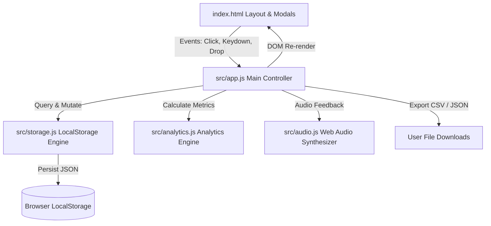
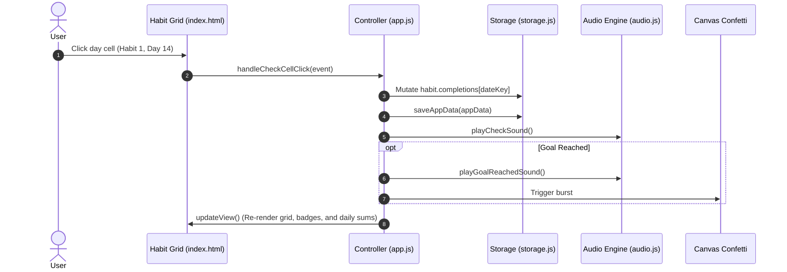

# Code Documentation - DailyHabits Pro

This document provides a comprehensive technical overview of the **DailyHabits Pro** codebase, its architecture, core data structures, algorithms, and execution lifecycle.

---

## 1. Directory & File Structure

```text
habit-tracker-2/
├── .github/                         # GitHub community templates
│   ├── ISSUE_TEMPLATE/
│   │   ├── bug_report.md            # Standardized bug reporting form
│   │   └── feature_request.md       # Structured feature suggestions
│   └── pull_request_template.md     # Code contribution checklist
├── dist/                            # Production bundle output (Vite build)
├── src/                             # Application source code
│   ├── analytics.js                 # Streaks, heatmaps, and metric algorithms
│   ├── app.js                       # Main controller, state, and UI event orchestration
│   ├── audio.js                     # Synthesized Web Audio API sound effects
│   ├── storage.js                   # LocalStorage persistence, seeds, CSV/JSON exports
│   └── style.css                    # Vanilla CSS design system (5 themes, sticky grid)
├── .gitignore                       # Git ignore rules for node_modules and builds
├── CODE_DOCUMENTATION.md            # Technical architecture and code guide
├── CODE_OF_CONDUCT.md               # Contributor Covenant v2.1 standard
├── CONTRIBUTING.md                   # Development workflow and submission guide
├── DESIGN_PHILOSOPHY.md             # Behavioral psychology and design decisions
├── index.html                       # Semantic single-page HTML layout & accessible modals
├── launch.bat                       # Automated Windows build & execution launcher
├── launch.sh                        # Automated Unix/macOS build & execution launcher
├── LICENSE                          # GNU General Public License v3.0
├── package.json                     # Vite and canvas-confetti dependencies
└── README.md                        # Project overview, quickstart, and feature breakdown
```

---

## 2. High-Level Architecture

DailyHabits Pro follows a **local-first, reactive modular MVC pattern** without the overhead of heavy virtual DOM frameworks:



- **Model Layer (`storage.js`)**: Encapsulates all interactions with browser `localStorage`. Exposes pure functions for loading, saving, seeding, importing, resetting, and exporting data as CSV and JSON.
- **Computation Layer (`analytics.js`)**: Computes real-time habit analytics (current/longest streaks, freeze-day allowances, monthly completion rates, 365-day heatmaps, day-of-week distributions).
- **Audio Feedback Layer (`audio.js`)**: Real-time sound generation using the native Web Audio API oscillators and gain envelopes with zero audio asset downloads.
- **Controller & View Layer (`app.js` + `style.css` + `index.html`)**: Manages UI tabs, modal lifecycle, theme cycling, table DOM rendering, and user action confirmations.

---

## 3. Core Modules & Function Reference

### `src/storage.js`
| Function | Parameters | Description |
|---|---|---|
| `loadAppData()` | none | Loads saved data from `dailyhabits_pro_data_v1` or generates starter demo habits if first launch. |
| `saveAppData(data)` | `data: Object` | Serializes application state to `localStorage`. |
| `loadSettings()` | none | Retrieves user configuration (theme, audio, confetti, active category). |
| `saveSettings(settings)` | `settings: Object` | Persists user settings to `dailyhabits_settings_v1`. |
| `formatDateKey(y, m, d)` | `y: Number, m: Number, d: Number` | Converts year, 0-indexed month, and day to `YYYY-MM-DD` string. |
| `parseDateKey(key)` | `key: String` | Parses `YYYY-MM-DD` string into `{ year, month, day }`. |
| `exportToJSON(data)` | `data: Object` | Formats data into a formatted JSON string for backup downloads. |
| `exportToCSV(habits, y, m)`| `habits: Array, y: Number, m: Number` | Converts active month table into CSV format with daily headers. |
| `exportAllTimeToCSV(habits)`| `habits: Array` | Compiles every recorded date entry across all years into a single CSV. |
| `clearAllData()` | none | Erases habits and notes, returning a clean 0-habit state. |
| `resetToDemoData()` | none | Re-populates fresh starter routines (Meditation, Reading, Hydration, etc.). |
| `importHabitData(curr, inc, mode)` | `curr: Object, inc: Object, mode: 'replace'\|'merge'` | Imports backup JSON either overwriting or merging with current routines. |

### `src/analytics.js`
| Function | Parameters | Description |
|---|---|---|
| `calculateStreak(habit)` | `habit: Object` | Calculates current streak, longest streak, and total completed days, respecting `skipped` (Streak Freeze) days. |
| `calculateMonthStats(habits, y, m)` | `habits: Array, y: Number, m: Number` | Calculates total completed days, completion percentage, and goals met for a given month. |
| `calculateDayOfWeekBreakdown(habits)` | `habits: Array` | Aggregates check-ins across Monday through Sunday. |
| `generateAnnualHeatmap(habits, y)` | `habits: Array, y: Number` | Generates a 365-day map with level intensity (0-4) for the consistency matrix. |

### `src/audio.js`
| Function | Parameters | Description |
|---|---|---|
| `playCheckSound()` | none | Synthesizes a high-pitch tactile sine pop (880 Hz -> 1760 Hz). |
| `playUncheckSound()` | none | Synthesizes a subtle descending frequency pop (440 Hz -> 220 Hz). |
| `playSkipSound()` | none | Synthesizes a gentle dual-tone freeze chime (523 Hz + 659 Hz). |
| `playGoalReachedSound()`| none | Plays an arpeggiated celebratory chord (C5, E5, G5, C6) when hitting goals. |

### `src/app.js`
| Function | Parameters | Description |
|---|---|---|
| `showConfirmation(options)` | `options: Object` | Promise-based custom modal for confirmations (`title`, `message`, `icon`, `confirmText`, `confirmType`). |
| `showToast(message, type)` | `message: String, type: String` | Displays animated toast notifications (`success`, `warn`, `error`). |
| `cycleTheme()` | none | Cycles between 5 curated themes (`dark`, `light`, `forest`, `ocean`, `sunset`). |
| `renderHabitGrid()` | none | Renders the high-density spreadsheet grid with sticky headers and columns. |
| `renderAnalytics()` | none | Populates KPI cards, 365-day activity matrix, day-of-week bars, and leaderboard. |
| `renderJournal()` | none | Displays daily reflection feed with mood badges and search filter. |

---

## 4. Data Flow Architecture



---

## 5. Dependencies

| Package | Version | Type | Purpose |
|---|---|---|---|
| `vite` | `^5.4.21` | devDependency | Ultra-fast dev server and production bundling with ES modules. |
| `canvas-confetti` | `^1.9.4` | dependency | Lightweight canvas confetti celebrations on goal achievement. |

---

## 6. Execution Lifecycle

1. **Bootstrap (`index.html` -> `src/app.js`)**:
   - `init()` is invoked on script load.
   - `loadAppData()` loads existing state from `localStorage` or initial seeds.
   - `applyTheme(settings.theme)` applies theme to document root `[data-theme]`.
   - Event listeners bound for month navigation, view tabs, shortcuts, and modals.
2. **Runtime Interactions**:
   - User inputs trigger localized state mutations and audio synthesis.
   - State changes immediately call `saveAppData()`.
   - Re-rendering uses batch innerHTML updates with minimal DOM thrashing.
3. **Offline Reliability**:
   - No external APIs or servers are queried during runtime.
   - 100% of data remains on the user's device.
