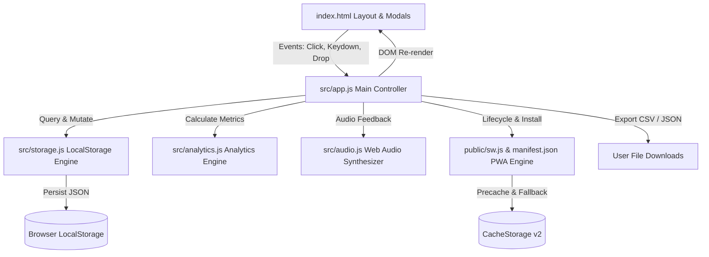
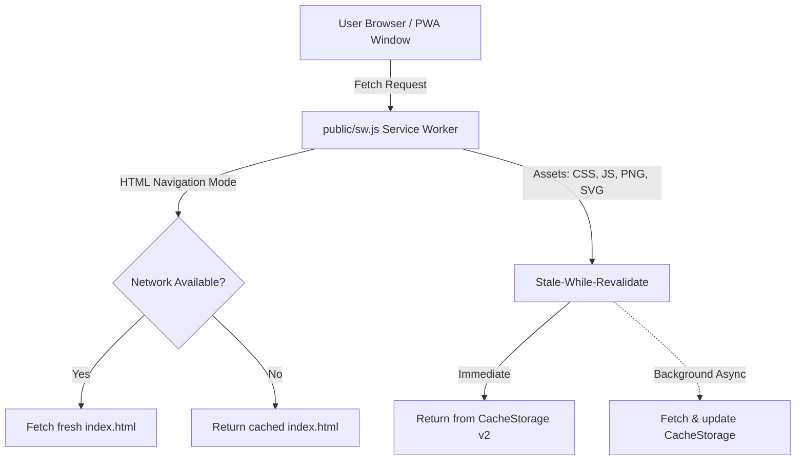
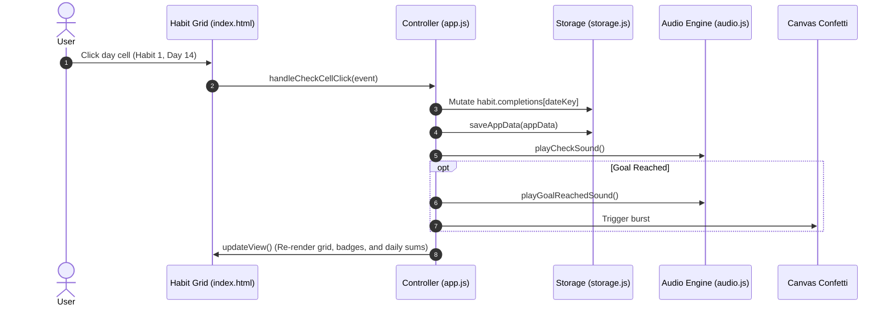

# Code Documentation - DailyHabits Pro

This document provides a comprehensive technical overview of the **DailyHabits Pro** codebase, its architecture, core data structures, algorithms, and execution lifecycle.

---

## 1. Directory & File Structure

```text
habit-tracker-2/
├── .github/                         # GitHub community templates
│   ├── ISSUE_TEMPLATE/
│   │   ├── bug_report.md            # Standardized bug reporting form
│   │   └── feature_request.md       # Structured feature suggestions
│   └── pull_request_template.md     # Code contribution checklist
├── dist/                            # Production bundle output (Vite build)
├── public/                          # Static PWA assets & Service Worker
│   ├── apple-touch-icon.png         # iOS Safari home screen icon (180x180)
│   ├── icon-192.png                 # Standard PWA app icon (192x192)
│   ├── icon-512.png                 # High-res & maskable PWA app icon (512x512)
│   ├── icon.svg                     # Crisp scalable vector brand icon
│   ├── manifest.json                # W3C Web App Manifest (standalone PWA)
│   └── sw.js                        # Native lightweight Service Worker (v2 cache)
├── src/                             # Application source code
│   ├── analytics.js                 # Streaks, heatmaps, and metric algorithms
│   ├── app.js                       # Main controller, state, PWA & theme orchestration
│   ├── audio.js                     # Synthesized Web Audio API sound effects
│   ├── storage.js                   # LocalStorage persistence, seeds, CSV/JSON exports
│   └── style.css                    # Design system (10 balanced themes, sticky grid)
├── .gitignore                       # Git ignore rules for node_modules and builds
├── CODE_DOCUMENTATION.md            # Technical architecture and code guide
├── CODE_OF_CONDUCT.md               # Contributor Covenant v2.1 standard
├── CONTRIBUTING.md                   # Development workflow and submission guide
├── DESIGN_PHILOSOPHY.md             # Behavioral psychology and design decisions
├── index.html                       # Semantic single-page HTML layout & accessible modals
├── launch.bat                       # Automated Windows build & execution launcher
├── launch.sh                        # Automated Unix/macOS build & execution launcher
├── LICENSE                          # GNU General Public License v3.0
├── package.json                     # Vite and canvas-confetti dependencies
├── README.md                        # Project overview, quickstart, and feature breakdown
└── vercel.json                      # Vercel deployment, PWA headers, and security rules
```

---

## 2. High-Level Architecture

DailyHabits Pro follows a **local-first, reactive modular MVC pattern with native PWA offline capability**:


```mermaid
graph TD
    A[index.html Layout & Modals] -->|Events: Click, Keydown, Drop| B[src/app.js Main Controller]
    B -->|Query & Mutate| C[src/storage.js LocalStorage Engine]
    B -->|Calculate Metrics| D[src/analytics.js Analytics Engine]
    B -->|Audio Feedback| E[src/audio.js Web Audio Synthesizer]
    B -->|Lifecycle & Install| H[public/sw.js & manifest.json PWA Engine]
    B -->|DOM Re-render| A
    C -->|Persist JSON| F[(Browser LocalStorage)]
    B -->|Export CSV / JSON| G[User File Downloads]
    H -->|Precache & Fallback| I[(CacheStorage v2)]
```

- **Model Layer (`storage.js`)**: Encapsulates all interactions with browser `localStorage`. Exposes pure functions for loading, saving, seeding, importing, resetting, and exporting data as CSV and JSON.
- **Computation Layer (`analytics.js`)**: Computes real-time habit analytics (current/longest streaks, freeze-day allowances, monthly completion rates, 365-day heatmaps, day-of-week distributions).
- **Audio Feedback Layer (`audio.js`)**: Real-time sound generation using the native Web Audio API oscillators and gain envelopes with zero audio asset downloads.
- **Controller & View Layer (`app.js` + `style.css` + `index.html`)**: Manages UI tabs, modal lifecycle, 10-theme cycling, Theme Gallery cards, table DOM rendering, and user action confirmations.
- **PWA Service Worker Layer (`sw.js` + `manifest.json`)**: Precaches the app shell, intercepts network requests with a Stale-While-Revalidate caching strategy, and enables standalone desktop/mobile installation.

---

## 3. Core Modules & Function Reference

### `src/storage.js`
| Function | Parameters | Description |
|---|---|---|
| `loadAppData()` | none | Loads saved data from `dailyhabits_pro_data_v1` or generates starter demo habits if first launch. |
| `saveAppData(data)` | `data: Object` | Serializes application state to `localStorage`. |
| `loadSettings()` | none | Retrieves user configuration (theme, audio, confetti, active category). |
| `saveSettings(settings)` | `settings: Object` | Persists user settings to `dailyhabits_settings_v1`. |
| `formatDateKey(y, m, d)` | `y: Number, m: Number, d: Number` | Converts year, 0-indexed month, and day to `YYYY-MM-DD` string. |
| `parseDateKey(key)` | `key: String` | Parses `YYYY-MM-DD` string into `{ year, month, day }`. |
| `exportToJSON(data)` | `data: Object` | Formats data into a formatted JSON string for backup downloads. |
| `exportToCSV(habits, y, m)`| `habits: Array, y: Number, m: Number` | Converts active month table into CSV format with daily headers. |
| `exportAllTimeToCSV(habits)`| `habits: Array` | Compiles every recorded date entry across all years into a single CSV. |
| `clearAllData()` | none | Erases habits and notes, returning a clean 0-habit state. |
| `resetToDemoData()` | none | Re-populates fresh starter routines (Meditation, Reading, Hydration, etc.). |
| `importHabitData(curr, inc, mode)` | `curr: Object, inc: Object, mode: 'replace'\|'merge'` | Imports backup JSON either overwriting or merging with current routines. |

### `src/analytics.js`
| Function | Parameters | Description |
|---|---|---|
| `calculateStreak(habit)` | `habit: Object` | Calculates current streak, longest streak, and total completed days, respecting `skipped` (Streak Freeze) days. |
| `calculateMonthStats(habits, y, m)` | `habits: Array, y: Number, m: Number` | Calculates total completed days, completion percentage, and goals met for a given month. |
| `calculateDayOfWeekBreakdown(habits)` | `habits: Array` | Aggregates check-ins across Monday through Sunday. |
| `generateAnnualHeatmap(habits, y, filterHabitId)` | `habits: Array, y: Number, filterHabitId?: String` | Generates a 365-day map with level intensity (0-4) for the consistency matrix, supporting optional routine filtering. |
| `calculateCategoryDistribution(habits, y, m, categories)` | `habits: Array, y: Number, m: Number, categories: Array` | Computes monthly check-in counts and percentages across custom life domains. |

### `src/audio.js`
| Function | Parameters | Description |
|---|---|---|
| `playCheckSound()` | none | Synthesizes a high-pitch tactile sine pop (880 Hz -> 1760 Hz). |
| `playUncheckSound()` | none | Synthesizes a subtle descending frequency pop (440 Hz -> 220 Hz). |
| `playSkipSound()` | none | Synthesizes a gentle dual-tone freeze chime (523 Hz + 659 Hz). |
| `playGoalReachedSound()`| none | Plays an arpeggiated celebratory chord (C5, E5, G5, C6) when hitting goals. |

### `src/app.js`
| Function | Parameters | Description |
|---|---|---|
| `showConfirmation(options)` | `options: Object` | Promise-based custom modal for confirmations (`title`, `message`, `icon`, `confirmText`, `confirmType`). |
| `showToast(message, type, duration, action)` | `message: String, type?: String, duration?: Number, action?: Object` | Displays animated toast notifications (`success`, `warn`, `error`) with optional interactive 1-click `action` ({ text, onClick }) for instant Undo. |
| `triggerCelebrationConfetti(options)` | `options?: Object` | Resilient confetti helper supporting both browser global (`window.confetti`) and bundlers without halting execution in unbundled environments. |
| `applyTheme(themeId)` | `themeId: String` | Applies theme attribute to document root `[data-theme]`, updates header label/icon, dynamically synchronizes `<meta name="theme-color">`, and updates Theme Gallery active state. |
| `cycleTheme()` | none | Cycles sequentially through all 10 curated themes (5 Dark & 5 Light) with toast feedback. |
| `renderThemeGalleryCards()` | none | Renders interactive preview cards for all 10 themes with color swatches, mode badges, and active checkmarks. |
| `openThemeGallery()` | none | Opens the Theme Gallery modal with current active theme highlighted. |
| `closeThemeGallery()` | none | Closes the Theme Gallery modal. |
| `setupPwa()` | none | Registers Service Worker (`sw.js`), listens for `beforeinstallprompt` / `appinstalled`, and configures standalone window mode display. |
| `triggerPwaInstall()` | none | Triggers native browser install prompt or presents guided installation modal (e.g. for iOS Safari). |
| `renderHabitGrid()` | none | Renders the high-density spreadsheet grid with sticky headers, archived badges, and dynamic unarchive row buttons. |
| `openQuickNoteModal(date, habitId, noteId)` | `date?: String, habitId?: String, noteId?: String` | Opens daily reflection dialog pre-populated for given date/habit with mood chips, non-overflowing titles, and preserved archived tags. |
| `closeQuickNoteModal()` | none | Closes reflection modal and resets text inputs. |
| `handleQuickNoteSubmit(e)` | `e?: Event` | Persists reflection to `appData.notes`, refreshes grid indicators, and displays toast. |
| `openDataModal(tab)` | `tab?: String` | Opens the 900px wide Data Management modal with vertical tabs (`export`, `import`, `archived`, `reset`). |
| `switchDataTab(tabName)` | `tabName: String` | Toggles active tab panels and sidebar buttons, rendering the archived routines vault on demand. |
| `renderDataModalArchivedList()` | none | Renders the list of paused routines in the Data Vault with habit swatches, individual restore buttons, and batch restore. |
| `renderAnalytics()` | none | Populates KPI cards, 365-day activity matrix (with routine filter), category effort distribution, day-of-week bars, and leaderboard with milestone badges. |
| `renderCategoryDistribution()` | none | Renders the monthly category effort progress bar and category cards. |
| `renderJournal()` | none | Displays daily reflection feed with mood chips filter, prompt ideas generator, 1-click edit buttons, and search filter. |
| `openCategoryModal()` | none | Opens the Category Manager dialog, populates swatches, and renders existing categories. |
| `closeCategoryModal()` | none | Closes Category Manager dialog and resets edit state. |
| `setCategoryEditMode(catId)` | `catId: String` | Loads targeted category into edit form for real-time renaming and color updating. |
| `handleCategoryFormSubmit(e)` | `e: Event` | Validates and persists new or edited category to `appData.categories` with reactive updates across the grid. |
| `handleDeleteCategory(catId)` | `catId: String` | Safely deletes a category, prompting confirmation and automatically migrating affected habits to a fallback category. |

---

## 4. PWA & Service Worker Offline Architecture

The Progressive Web App implementation transforms DailyHabits Pro into a standalone, installable desktop and mobile application without bloating the repository with third-party wrappers:


```mermaid
graph TD
    UserBrowser[User Browser / PWA Window] -->|Fetch Request| SW[public/sw.js Service Worker]
    SW -->|HTML Navigation Mode| NetFirst{Network Available?}
    NetFirst -->|Yes| OnlineFetch[Fetch fresh index.html]
    NetFirst -->|No| CacheFall[Return cached index.html]
    SW -->|Assets: CSS, JS, PNG, SVG| SWR[Stale-While-Revalidate]
    SWR -->|Immediate| ReturnCache[Return from CacheStorage v2]
    SWR -.->|Background Async| UpdateCache[Fetch & update CacheStorage]
```

- **Manifest Configuration (`public/manifest.json`)**: Configured with `display: "standalone"`, `display_override: ["window-controls-overlay", "standalone"]`, shortcuts to Jump to Today, and SVG/PNG icon sets.
- **Cache Strategy**:
  - **Navigation (`request.mode === 'navigate'`)**: Network-first with instant fallback to cached `./index.html` to guarantee offline launch.
  - **Static Shell Assets**: Stale-While-Revalidate caching pattern for instantaneous UI startup under 50ms.
  - **Cache Versioning**: Uses namespaced `dailyhabits-pro-v2` cache keys with automatic purging of legacy cache stores during the `activate` event.
- **Install Flow**:
  - Listens for `beforeinstallprompt`, stores the event in `deferredInstallPrompt`, and unhides the header `#pwaInstallBtn`.
  - When installed, `appinstalled` resets prompt state and displays a celebration toast.
  - Detects standalone mode via `(display-mode: standalone)` and `window.navigator.standalone` to streamline UI actions.

---

## 5. Data Flow Architecture


```mermaid
sequenceDiagram
    autonumber
    actor User
    participant View as Habit Grid (index.html)
    participant Ctrl as Controller (app.js)
    participant Store as Storage (storage.js)
    participant Audio as Audio Engine (audio.js)
    participant Confetti as Canvas Confetti

    User->>View: Click day cell (Habit 1, Day 14)
    View->>Ctrl: handleCheckCellClick(event)
    Ctrl->>Store: Mutate habit.completions[dateKey]
    Ctrl->>Store: saveAppData(appData)
    Ctrl->>Audio: playCheckSound()
    opt Goal Reached
        Ctrl->>Audio: playGoalReachedSound()
        Ctrl->>Confetti: Trigger burst
    end
    Ctrl->>View: updateView() (Re-render grid, badges, and daily sums)
```

---

## 6. Dependencies

| Package | Version | Type | Purpose |
|---|---|---|---|
| `vite` | `^5.4.21` | devDependency | Ultra-fast dev server and production bundling with ES modules. |
| `canvas-confetti` | `^1.9.4` | dependency | Lightweight canvas confetti celebrations on goal achievement. |

---

## 7. Execution Lifecycle

1. **Bootstrap (`index.html` -> `src/app.js`)**:
   - `init()` is invoked on script load.
   - `loadAppData()` loads existing state from `localStorage` or initial seeds.
   - `applyTheme(settings.theme)` applies theme to document root `[data-theme]` and syncs `<meta name="theme-color">`.
   - `setupPwa()` registers `sw.js` and hooks PWA install events.
   - Event listeners bound for month navigation, view tabs, shortcuts, Theme Gallery, PWA install actions, and modals.
2. **Runtime Interactions**:
   - User inputs trigger localized state mutations, audio synthesis, and visual feedback toasts.
   - Non-disruptive toast alerts notify users on habit creation, updates, category changes, sound toggling, goal milestones, and data exports.
   - State changes immediately call `saveAppData()`.
   - Grid rendering uses structured `.habit-category-tag` pills with `.habit-cat-indicator` rounded color bars and cohesive spacing next to quantitative metric tags.
3. **Offline Reliability**:
   - The Service Worker caches application assets into `dailyhabits-pro-v2`.
   - All habit tracking, streaks, reflections, and exports operate 100% offline without network requests.
   - 100% of data remains securely stored on the user's device.
