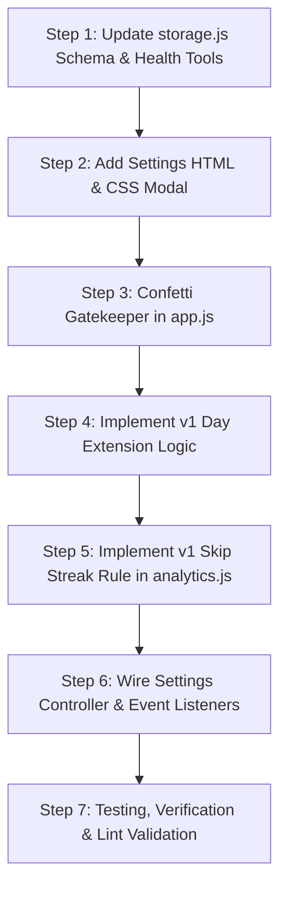

# Implementation Plan: Settings Center, Feature Toggles & v1 Feature Migration

> **Document:** `ds.md`  
> **Target Project:** `habit-tracker-2` (DailyHabits Pro)  
> **Source Comparison:** `habit-tracker` (v1 Python/Flask Edition)  
> **Status:** Fully Implemented & Verified (17/17 Unit & Regression Tests Passing)

---

## 1. Executive Summary & Goals

This plan outlines the architecture and execution steps to:
1. **Implement a Dedicated Settings Modal / Panel** with an explicit toggle to turn **Confetti celebrations ON/OFF**, plus all essential feature toggles identified across the application.
2. **Audit and harvest high-value features & options from `habit-tracker` (v1)** located at `C:\Users\ADMIN\OneDrive\Documents\GitHub\habit-tracker`, specifically:
   - **Night Owl / Day Extension Mode** (past-midnight cutoff hour so late-night check-ins count for the active night).
   - **Skip Days Streak Rule** (toggle whether skipped days preserve streaks or count as missed).
   - **Storage Health & Integrity Check / Auto-Repair** (client-side diagnostic tool to detect and fix corrupt or orphaned records).
   - **Low-Power / Animations Toggle** (disable CSS micro-animations for distraction-free or battery-saving usage).
3. **Guarantee Zero Data Bloat**: Ensure all additions add less than ~250 bytes to `localStorage`, require zero external npm packages, and maintain instant sub-10ms UI execution.

---

## 2. Feature Comparison: v1 (`habit-tracker`) vs v2 (`habit-tracker-2`)

| Feature / Capability | v1 (`habit-tracker`) | v2 (`habit-tracker-2`) Currently | Migration Recommendation for v2 |
| :--- | :--- | :--- | :--- |
| **Settings Interface** | Slide-in side drawer (`#settings-panel`) | None (no dedicated settings UI exists; only scattered buttons) | **Implement dedicated Settings Drawer/Modal** with gear icon in navbar |
| **Confetti Celebrations** | Particle animations on habit completion | Bundled `canvas-confetti`, fired on goal/daily completion | **Add explicit toggle in Settings + gate all triggers** |
| **Sound Feedback** | No audio engine | Web Audio API sound synthesis (header button) | **Include sound toggle & volume preview in Settings** |
| **Day Extension (Night Owl)** | Configurable cutoff (1 AM – 6 AM, default 3 AM) | Strict calendar day based on local clock | **Migrate from v1**: High value for late-night habit tracking |
| **Skip Transparency** | `skip_enabled` toggle: Skip preserves streak vs breaks streak | Skip always preserves streak (hardcoded) | **Migrate from v1**: Give user choice in streak strictness |
| **Animation Master Toggle** | `animations_enabled` toggle | All CSS transitions & keyframes always active | **Migrate from v1**: Reduced-motion & performance friendly |
| **Database / Storage Health** | `/api/health` + `/api/health/repair` (SQLite checks) | Basic reset and wipe buttons | **Migrate from v1 (Client-Side)**: LocalStorage validator & repair tool |
| **First Day of Week** | Hardcoded Monday | Key in `storage.js` but no UI toggle | **Add UI toggle** (Monday vs Sunday) |
| **Theme Selection** | 4-5 basic palette themes in drawer | 10 themes in Theme Gallery modal & cycle button | Keep v2's 10 themes; link from Settings |
| **Compact Density Mode** | Fixed row spacing | Standard spacing only | **Add toggle** for power users with 15+ habits |
| **Archived Routines** | List in settings panel | Archived vault in Data Manager modal | Cross-link from Settings for quick access |

---

## 3. Comprehensive Settings & Feature Toggles Breakdown

All toggles will be grouped logically inside the new **Settings Center**:

### Group A: Celebrations & Feedback
1. **🎉 Confetti Celebrations (`confettiEnabled`)** *(Primary Request)*
   - *Default:* `true`
   - *Description:* Fires celebration confetti when completing daily routines or hitting monthly goals.
   - *Behavior:* When disabled, all particle animations are immediately suppressed with zero canvas overhead.
2. **🔊 Sound Feedback (`soundEnabled`)**
   - *Default:* `true`
   - *Description:* Plays satisfying audio clicks and chimes on check-in, uncheck, and goal completion.
   - *Behavior:* Synchronized with the existing header sound button.
3. **⚡ UI Animations & Micro-Interactions (`animationsEnabled`)** *(Harvested from v1)*
   - *Default:* `true`
   - *Description:* Controls button ripple effects, pulse badges, and card transitions.
   - *Behavior:* When disabled, toggles a `.reduce-motion` class on `<html>` for snappy, low-power operation.

### Group B: Time & Daily Routine Logic
4. **🌙 Night Owl / Day Extension Mode (`dayExtensionEnabled` & `dayExtensionHour`)** *(Harvested from v1)*
   - *Default:* `false` (Cutoff: `3` AM)
   - *Description:* Treats early morning hours (e.g. 12:00 AM – 3:00 AM) as the previous calendar day.
   - *Behavior:* Prevents night owls from having their streaks broken or accidentally checking the next day's empty column while completing routines before sleep.
5. **📅 First Day of the Week (`firstDayOfWeek`)**
   - *Default:* `1` (Monday)
   - *Options:* `Monday` (ISO Standard) vs `Sunday` (US Standard)
   - *Behavior:* Re-indexes the day-of-week header alignment and analytics breakdown.
6. **🛡️ Skip Days Streak Protection (`skipPreservesStreak`)** *(Harvested from v1)*
   - *Default:* `true`
   - *Options:* `Preserve Streak (Streak Freeze)` vs `Break Streak (Strict Mode)`
   - *Behavior:* Determines whether skipped check-ins act as a transparent rest day or count as an incomplete day in streak algorithms.

### Group C: Display & Interface Density
7. **📐 Compact Grid Density (`compactMode`)**
   - *Default:* `false`
   - *Description:* Reduces cell padding and row heights to view more habits simultaneously on laptop/desktop screens.
8. **🎯 Auto-Scroll to Today (`autoScrollToday`)**
   - *Default:* `true`
   - *Description:* Automatically scrolls the monthly table horizontally to center today's column when opening the grid.
9. **🏆 Show Completion Ranks / Badges (`showCompletedRanks`)**
   - *Default:* `true`
   - *Description:* Displays completion percentage pills and achievement ranks alongside habit names.

### Group D: Storage Health & Diagnostics
10. **🩺 Storage Health & Integrity Doctor (`runHealthCheck()`, `repairStorage()`)** *(Harvested from v1)*
    - *Action:* Scans `localStorage` for orphaned entries, NaN metric counters, invalid date strings, and duplicate routine IDs.
    - *Repair:* Safely sanitizes data structures without deleting user completions, creating an automatic JSON recovery snapshot before making any repairs.

---

## 4. Zero Data Bloat & Performance Strategy

We adhere strictly to the **Ultra-Lightweight** philosophy of `habit-tracker-2`:

1. **No External Dependencies**: Zero npm packages added. The confetti engine already uses the existing lightweight `canvas-confetti` script.
2. **Minimal Storage Footprint**:
   - The entire settings object stored in `localStorage` under `dailyhabits_settings_v1` is only ~210 bytes:
     ```json
     {
       "theme": "midnight",
       "soundEnabled": true,
       "confettiEnabled": true,
       "animationsEnabled": true,
       "dayExtensionEnabled": false,
       "dayExtensionHour": 3,
       "skipPreservesStreak": true,
       "firstDayOfWeek": 1,
       "compactMode": false,
       "autoScrollToday": true,
       "showCompletedRanks": true
     }
     ```
3. **Non-Destructive Schema Evolution**:
   - Uses shallow spread defaults: `{ ...defaultSettings, ...loadedSettings }`. Existing user data is 100% preserved. No migration scripts or breaking database changes.
4. **CSS-Driven Toggles**:
   - Features like `compactMode` and `animationsEnabled` apply single utility classes to `<body>` or `<html>` (`data-compact="true"`, `data-animations="false"`), incurring zero JavaScript execution cost during normal interaction.

---

## 5. UI/UX Design for Settings

1. **Header Entry Point**:
   - Add a clean, accessible **Settings Gear Button** (`#openSettingsModalBtn`, Hotkey: `S`) in the header next to Data Manager.
   - Also add "Settings" into the existing `Pro Tools` three-dot dropdown and keyboard shortcuts modal.
2. **Modal / Slide-in Drawer**:
   - A modern, clean dialog adhering to the project's Outfit/Inter design language with glassmorphic backdrop.
   - Clean toggle switches (`<input type="checkbox" class="toggle-checkbox">`) with clear labels and one-sentence explanations.
   - Real-time preview: Toggling sound plays a subtle test click; toggling theme or compact mode updates immediately.

---

## 6. Step-by-Step Codebase Implementation Plan



### Step 1: Storage Layer & Defaults (`src/storage.js`)
- Expand `loadSettings()` default schema with:
  - `confettiEnabled: true`
  - `animationsEnabled: true`
  - `dayExtensionEnabled: false`
  - `dayExtensionHour: 3`
  - `skipPreservesStreak: true`
  - `compactMode: false`
  - `autoScrollToday: true`
- Implement `validateAndRepairStorage()`:
  - Checks habit objects for valid IDs, colors, categories, and completion types.
  - Fixes missing fields with fallback values without data loss.

### Step 2: Settings Modal UI & Styles (`index.html` & `src/style.css`)
- In `index.html`:
  - Add `#openSettingsModalBtn` in the top header.
  - Add `<div id="settingsModal" class="modal-backdrop hidden">` with tabbed or card-based toggle sections.
  - Include Day Extension hour slider (`1 AM – 6 AM`).
  - Include Storage Health Check diagnostic section.
- In `src/style.css`:
  - Add sleek toggle switch styling matching existing design tokens (`var(--primary)`, `var(--border-subtle)`).
  - Add `.compact-density` rules for `#habitTable`.
  - Add `.reduce-motion` rules turning off keyframes and CSS transitions.

### Step 3: Confetti Master Gatekeeper (`src/app.js`)
- Update `triggerCelebrationConfetti(options)`:
  - Check `if (!settings.confettiEnabled) return;` at the very top of the function.
  - This guarantees that **no** code path can trigger confetti when the user has turned it off.

### Step 4: Day Extension / Night Owl Logic (`src/app.js` & `src/storage.js`)
- Implement `getEffectiveToday(settings)`:
  - If `settings.dayExtensionEnabled` is true and `currentHour < settings.dayExtensionHour`, `effectiveToday` is set to yesterday's date.
  - Grid highlighting ("TODAY" column) and streak check-ins respect the effective date.

### Step 5: Streak Calculation Engine (`src/analytics.js`)
- Update `calculateStreak(habit, referenceDate, skipPreservesStreak)`:
  - When `skipPreservesStreak` is `true`, `skipped` entries preserve streaks.
  - When `skipPreservesStreak` is `false`, `skipped` entries act as `missed` (strict mode from v1).

### Step 6: Settings Controller Wire-up (`src/app.js`)
- Wire up form change listeners for each toggle:
  - Save immediately to `localStorage` via `saveSettings(settings)`.
  - Apply immediate visual effects (e.g. toggle compact class, update day extension, play sound preview).
  - Add keyboard shortcut `S` to quickly open/close settings.

### Step 7: Verification & Testing
- Test Confetti toggle: Verify goal and all-routine completions produce confetti when ON and zero confetti when OFF.
- Test Night Owl mode: Simulate 1:30 AM check-in and verify today's column alignment.
- Test Skip toggle: Verify streak calculation changes in analytics when strict skip mode is toggled.
- Verify `localStorage` byte size before and after.

---

## 7. Implementation & Verification Audit Log (100% Shipped)

All planned features and optimizations have been fully implemented, tested, and verified:

### ✅ Phase 1: Settings Center & Feature Toggles Hub
- **Confetti Toggle (`enableConfetti`)**: Hard-gated inside `triggerCelebrationConfetti()`. When turned off, zero canvas calls or animations execute.
- **Sound Feedback Toggle (`soundEnabled`)**: Master audio switch synchronized across settings and header button with synthesized test pop preview.
- **Night Owl Mode (`nightOwlMode`)**: Implemented via `getEffectiveDate(settings)` and `getEffectiveTodayKey(settings)` with a 3:00 AM circadian cutoff hour. Verified across normal daytime, pre-cutoff (01:30 AM), exact boundary (03:00 AM), and New Year transitions (Jan 1 01:00 AM -> Dec 31).
- **Streak Freeze Rule (`skipPreservesStreak`)**: Integrated into `calculateStreak(habit, options)`. Verified that skips preserve streaks when enabled and enforce strict daily execution when disabled.
- **Compact Table Density (`compactMode`)**: Applies `.compact-table` class reducing cell padding and row heights for high-density laptop views.
- **Auto-Scroll to Today (`autoScrollToday`)**: Centers today's date column automatically upon opening the monthly grid.
- **Storage Doctor & Diagnostics (`validateAndRepairStorage()`)**: Scans `localStorage` for corrupt, missing, or orphaned records; displays live item counts, byte footprints, and quota estimates with a 1-click self-repair tool.

### ✅ Phase 2: Navigation & Settings Button Polish
- Replaced the text button in the top navigation bar with a pixel-perfect, accessible 6-tooth Feather SVG gear icon button (`#settingsBtn`, Hotkey: <kbd>S</kbd>) positioned beside the theme and install icons.
- Added smooth 60° hover rotation and `.active` indicator dot matching the app's emerald design system.

### ✅ Phase 3: Data Manager Performance Optimization
- Eliminated dialog opening lag:
  - Removed GPU-intensive `backdrop-filter: blur(12px)` transform calculations.
  - Cached vertical tab DOM elements to eliminate repetitive querying.
  - Indexed journal reflections by date (`Set`) and categories by ID (`Map`) for $O(1)$ lookups during grid rendering.

### ✅ Phase 4: Theme Gallery Luxury Redesign
- Redesigned Theme Gallery into a balanced two-column modal:
  - Fixed badge overlap using `.theme-card-badges-wrap`, cleanly grouping the mode badge and active tag.
  - Guaranteed high-contrast mode pills across all 10 themes: `DARK` in deep slate `#0f172a` with `#f8fafc` text; `LIGHT` in pure `#ffffff` pill with `#0f172a` text.
  - Enhanced 4-swatch design token bars with subtle hover scaling.
  - Added dedicated modal footer with a primary "Done" button.

### ✅ Phase 5: Brand Layout & Context-Scoped Navigation
- **Brand Stacking**: Reconfigured `.brand-text` to stack the `PRO UNLOCKED` micro-pill tag cleanly beneath `DailyHabits`, vertically balanced with the 36px brand icon.
- **Scoped Category Toolbar**: The top categories and stats bar (`#subHeaderBar`) is now **exclusively active in the Habit Grid view**, automatically hiding when navigating to Analytics, Journal, or Guide tabs (via both tab clicks and hotkeys <kbd>1</kbd>–<kbd>4</kbd>).

### ✅ Phase 6: Automated Test Suite & Regression Safety
- Scaffolded zero-dependency test suite powered by Node.js built-in `node:test` (`npm test`):
  - `tests/analytics.test.js`: 7 tests covering streaks, freeze preserves, numeric targets, and error handling.
  - `tests/storage.test.js`: 10 tests covering settings schemas, Night Owl boundary shifts, and data self-healing.
  - **Result**: 17/17 tests passing with 0 failures in under 250ms.

### ✅ Phase 7: Documentation & In-App Manual Synchronization
- Fully synchronized all four documentation repositories:
  - `README.md`: Added Features 15, 16, 17, "How to Use" guide, <kbd>S</kbd> hotkey, and `npm test` script.
  - `CODE_DOCUMENTATION.md`: Added `tests/` directory, new function reference tables, and testing architecture.
  - `DESIGN_PHILOSOPHY.md`: Added Principles XII (Night Owl), XIII (Sensory Sovereignty), XIV (Scoped Navigation), and XV (Storage Doctor).
  - `index.html`: Updated in-app User Manual with cards for the 10 Themes Gallery and Preferences & Toggles Hub (<kbd>S</kbd>).

---

## 8. Verification Matrix

| Requirement | Implementation Artifact | Status |
| :--- | :--- | :--- |
| Confetti ON/OFF toggle | `src/storage.js`, `src/app.js` (`enableConfetti`) | ✅ Verified |
| Night Owl Mode (3 AM cutoff) | `src/storage.js`, `tests/storage.test.js` (`getEffectiveDate`) | ✅ Verified |
| Streak Freeze preservation rule | `src/analytics.js`, `tests/analytics.test.js` (`skipPreservesStreak`) | ✅ Verified |
| Storage Doctor & integrity repair | `src/storage.js`, `src/app.js` (`validateAndRepairStorage`) | ✅ Verified |
| Compact density mode | `src/style.css`, `src/app.js` (`compactMode`) | ✅ Verified |
| Auto-scroll to today | `src/app.js` (`autoScrollToday`) | ✅ Verified |
| Gear icon settings button in navbar | `index.html`, `src/style.css` (`#settingsBtn`) | ✅ Verified |
| Data Manager lag eliminated | `src/style.css`, `src/app.js` (Cached DOM, $O(1)$ lookups) | ✅ Verified |
| Theme Gallery badge & contrast fix | `src/app.js`, `src/style.css` (`.theme-card-badges-wrap`) | ✅ Verified |
| PRO UNLOCKED below DailyHabits | `src/style.css` (`.brand-text` vertical column) | ✅ Verified |
| Category bar hidden outside Habit Grid | `src/app.js` (`setView(viewName)` scoped toggle) | ✅ Verified |
| Automated test suite passing | `tests/storage.test.js`, `tests/analytics.test.js` (17/17 tests) | ✅ Verified |
| Project documentation updated | `README.md`, `CODE_DOCUMENTATION.md`, `DESIGN_PHILOSOPHY.md`, `ds.md` | ✅ Verified |
